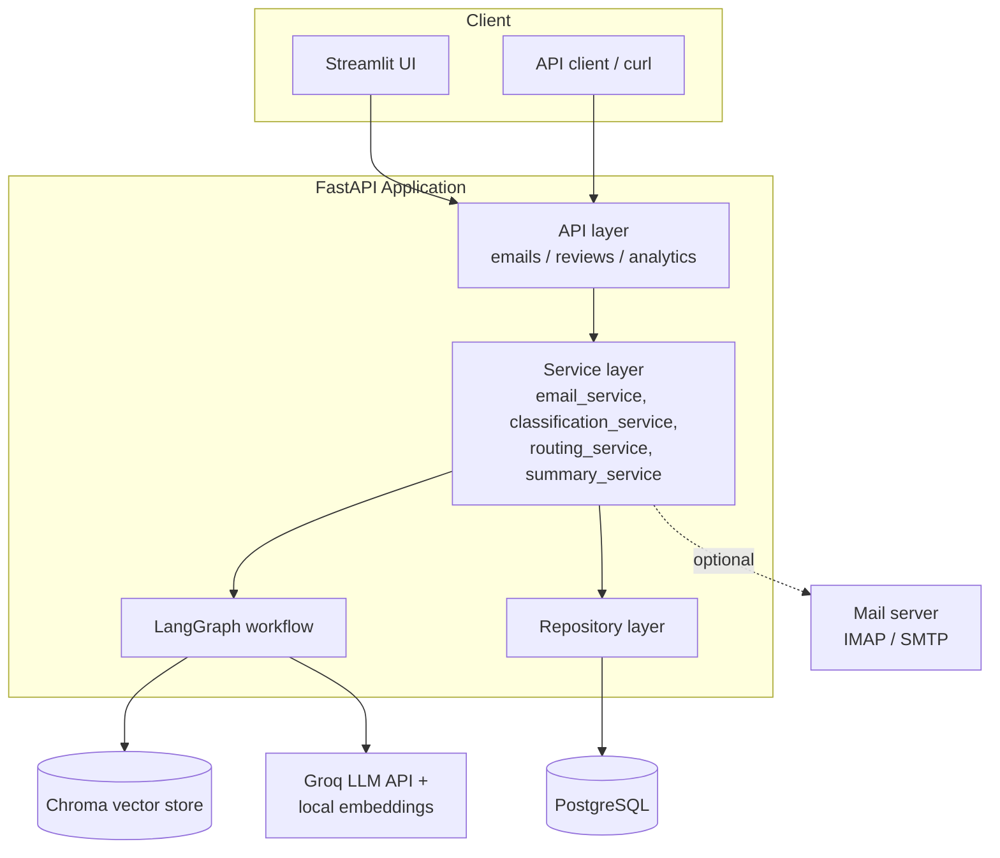
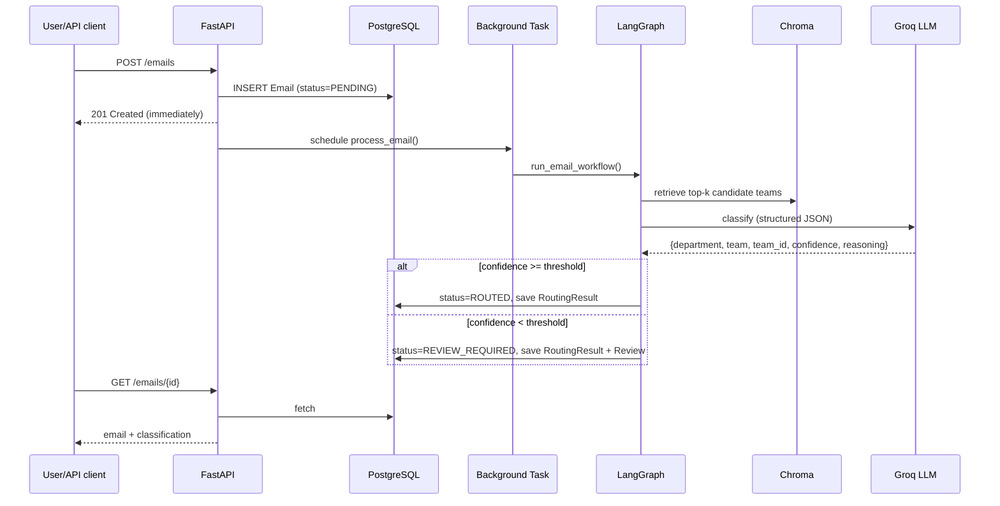
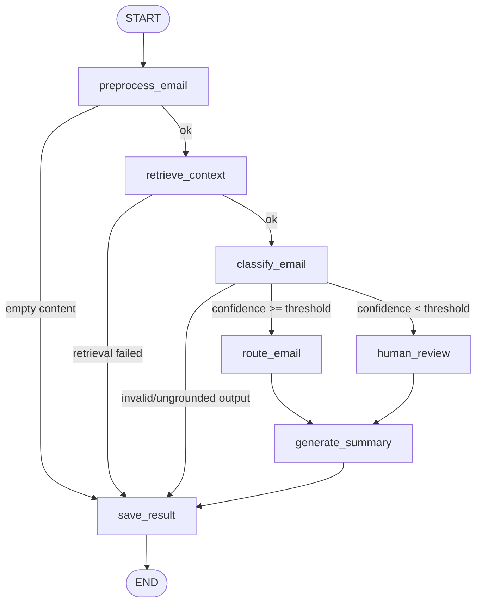
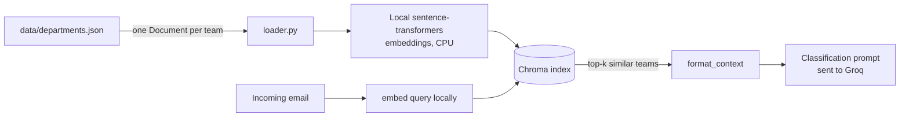
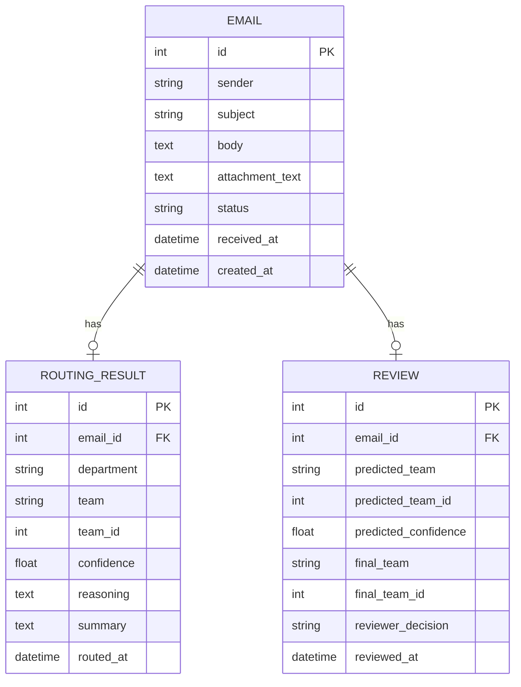

# AI-Powered Enterprise Email Routing & Triage System

A backend system that classifies incoming organizational emails and routes
them to the correct team, using retrieval-augmented generation (RAG) for
grounding, an LLM for classification with structured/validated output,
LangGraph for orchestration, and a human-in-the-loop review flow for
low-confidence predictions.

**This is a portfolio prototype**, evaluated on a labeled synthetic
dataset — not a production system. See [Limitations](#limitations).

---

## Table of contents

1. [Overview & motivation](#overview--motivation)
2. [Architecture](#architecture)
3. [Data flow](#data-flow)
4. [LangGraph workflow](#langgraph-workflow)
5. [RAG architecture](#rag-architecture)
6. [Database schema](#database-schema)
7. [API documentation](#api-documentation)
8. [Email networking architecture](#email-networking-architecture)
9. [Human-in-the-loop workflow](#human-in-the-loop-workflow)
10. [Evaluation methodology & results](#evaluation-methodology--results)
11. [Limitations](#limitations)
12. [Setup instructions](#setup-instructions)
13. [Environment variables](#environment-variables)
14. [Docker](#docker)
15. [Testing](#testing)
16. [Future improvements](#future-improvements)

---

## Overview & motivation

Large organizations receive emails that need to reach the right internal
team — IT, Billing, HR, Legal, and so on. Manually triaging these is slow
and error-prone. This project automates that triage: an email comes in,
the system retrieves relevant organizational context, an LLM classifies
it into a department/team with a confidence score, high-confidence
predictions route automatically, and low-confidence ones go to a human
reviewer.

It's built as a **modular monolith** — one deployable FastAPI service,
internally organized into clean layers — rather than microservices,
because the system is small enough that network-hop complexity between
separate services would add operational overhead without adding value.

---

## Architecture



**Layers, and why each exists:**

| Layer | Responsibility |
|---|---|
| API (`app/api/`) | Request validation (Pydantic), HTTP status codes — no business logic |
| Service (`app/services/`) | Orchestrates use cases: create an email, run classification, send notifications |
| Graph (`app/graph/`) | The actual multi-step, conditionally-branching workflow (LangGraph) |
| RAG (`app/rag/`) | Knowledge base loading, embeddings, vector store, retrieval, prompts |
| Repository (`app/database/repositories.py`) | Every direct SQL query lives here — the only file that would change if we switched ORMs |
| Integrations (`app/integrations/`) | IMAP, SMTP, PDF extraction, MIME parsing |

---

## Data flow



The response to `POST /emails` returns **before** classification runs —
see the "Why background processing?" row in the technology table below.

---

## LangGraph workflow



**State** (`app/graph/state.py`) is a `TypedDict` — LangGraph merges each
node's partial return into it, rather than nodes mutating a shared object.

**Nodes** (`app/graph/nodes.py`) are produced by factory functions that
close over shared dependencies (LLM client, vector store, DB session
factory), so `tests/test_graph.py` can build the exact same graph with
fake dependencies and no network calls.

**Why LangGraph** rather than a plain function pipeline: the workflow has
genuine conditional branching (confidence-based routing) driven by shared,
evolving state — exactly the case a graph-based orchestrator is for. A
plain function chain would need its own ad hoc branching logic, hand-rolled.

---

## RAG architecture



- **One document per team, not per department** — the classification
  target is team-level, so retrieval granularity matches the decision.
- **Embeddings run locally** via `sentence-transformers` (CPU), not a
  remote API — no account, no payment method, no per-call cost or
  network dependency once the model is cached. `HuggingFaceInferenceEmbeddings`
  remains in the codebase for anyone with Hugging Face billing configured.
- **The LLM never invents a `team_id`** — `classification_service.py`
  enforces that the returned `team_id` is one of the retrieved
  candidates' IDs, in code, not just via prompt instructions.
- **Why Chroma**: a local, persisted vector store is sufficient at this
  scale (10 teams); a managed vector DB would be unjustified
  infrastructure for a knowledge base this size.

---

## Database schema



`Email.status` values: `PENDING → PROCESSING → ROUTED | REVIEW_REQUIRED |
FAILED`, and `REVIEW_REQUIRED → RESOLVED` once a human decides.

**Why PostgreSQL + SQLAlchemy**: the data is genuinely relational — one
email has one routing result and, sometimes, one review — a legitimate
use case for a relational DB, not a default choice made without thought.

---

## API documentation

| Method | Path | Description |
|---|---|---|
| POST | `/emails` | Submit an email; returns immediately (status `PENDING`), processing runs in the background |
| GET | `/emails` | List emails (paginated) |
| GET | `/emails/{id}` | Email detail, including routing result if available |
| GET | `/emails/{id}/classification` | Classification details (409 if not yet classified) |
| GET | `/emails/{id}/summary` | Generated summary (409 if not yet processed) |
| GET | `/reviews/pending` | Emails awaiting human review |
| POST | `/reviews/{id}` | Submit a human decision (`{"final_team": str, "final_team_id": int}`) |
| GET | `/analytics` | Aggregate stats: totals, auto-routed vs. reviewed, average confidence, by department/team |
| GET | `/health` | Liveness **and** database connectivity |

Full interactive docs at `/docs` once the server is running.

---

## Email networking architecture

```
Sender --SMTP--> Mail Server --IMAP--> This Application --> Classification --SMTP--> Destination Team
```

- **SMTP** (Simple Mail Transfer Protocol) is how mail gets *sent* —
  both the original sender-to-mail-server hop, and this application's
  own notification to the destination team (`app/integrations/smtp_client.py`).
- **IMAP** (Internet Message Access Protocol) is how mail gets *retrieved*
  — this application connects to a mailbox and pulls messages down
  (`app/integrations/imap_client.py`).
- **MIME** is the format email bodies/attachments are structured in;
  `app/integrations/email_parser.py` parses raw MIME bytes into
  sender/subject/body/attachments using Python's standard `email` module.
- **This project does not implement a mail server.** It's an application
  that speaks IMAP/SMTP as a *client* to existing infrastructure (Gmail,
  Outlook, or any standard mail server) — the same way any email client
  does.
- Three operating modes exist specifically so real mailbox access is
  never required to demonstrate the system: **API mode** (`POST /emails`),
  **sample dataset mode** (`data/sample_emails.json`), and **real IMAP
  mode** (calling `app.integrations.imap_client.fetch_unseen_emails()`).

---

## Human-in-the-loop workflow

1. Classification produces a `confidence` score.
2. `confidence >= CONFIDENCE_THRESHOLD` (default 0.80) leads to the `route_email` node and status `ROUTED`.
3. `confidence < CONFIDENCE_THRESHOLD` leads to the `human_review` node, status `REVIEW_REQUIRED`, and a `Review` row is created (`reviewer_decision=PENDING`).
4. A reviewer (via Streamlit's "Human Review" tab, or `POST /reviews/{id}`) sees the AI's prediction and the original email, and submits the correct team.
5. Both the **AI's original prediction** and the **human's final decision** are stored (`Review.predicted_team_id` vs. `Review.final_team_id`), with `reviewer_decision` recorded as `APPROVED` (human agreed) or `CORRECTED` (human overrode).
6. The email's status moves to `RESOLVED`.

**Important limitation, stated explicitly**: the LLM's `confidence` score
is an **application-level heuristic**, not a statistically calibrated
probability. A model reporting "0.91" is not claiming a measured 91%
historical accuracy rate at that score — it's the model's own
self-assessment, which can be miscalibrated (overconfident or
underconfident) in ways we have not independently measured. The
confidence threshold is a practical routing lever, tuned by observing
behavior, not a probabilistic guarantee.

---

## Evaluation methodology & results

Three approaches are compared on the same labeled dataset
(`data/evaluation_emails.json`, 78 synthetic examples across 10 teams,
tagged by difficulty: straightforward, reworded, ambiguous, multi-issue,
confusable):

1. **Keyword baseline** (`evaluation/keyword_baseline.py`) — no LLM, no
   embeddings, no network. Scores each team by word-overlap.
2. **LLM only, no RAG** (`evaluation/llm_only.py`) — the LLM sees only a
   bare list of team names/IDs, no descriptions or examples, and no
   retrieval narrowing.
3. **RAG + LLM** (production path, `app/services/classification_service.py`)
   — retrieval surfaces relevant team context, which grounds the LLM's
   decision and constrains it to only retrieved `team_id`s.

Run it yourself:
```bash
python -m scripts.generate_evaluation_dataset   # (re)generate the dataset
python -m evaluation.evaluate_classification    # keyword baseline only, no token needed
python -m evaluation.compare_methods            # all three approaches, needs GROQ_API_KEY
```

### Actual results from this dataset

The keyword baseline was run for real, in this repository, computing
metrics from `evaluation/metrics.py` — no numbers here are invented:

| Approach | Accuracy | Precision | Recall | F1 |
|---|---:|---:|---:|---:|
| Keyword baseline | 82.1% | 84.4% | 81.5% | 82.4% |

**By difficulty (keyword baseline):**

| Difficulty | Accuracy |
|---|---:|
| Straightforward | 100% |
| Multi-issue | 75% |
| Confusable | 62.5% |
| Ambiguous | 60% |
| Reworded | 66.7% |

This is exactly the pattern that motivates moving beyond keyword matching:
perfect on emails phrased like the training examples, degrading sharply
once wording diverges ("reworded") or vocabulary overlaps between
similar teams ("confusable"). Semantic embeddings are specifically meant
to close that gap, since they match on meaning rather than exact words.

**LLM-only and RAG+LLM numbers are not included here** — they require a
real `GROQ_API_KEY` (free, no card needed — see Setup instructions), which
this development sandbox could not obtain interactively. Run
`python -m evaluation.compare_methods` yourself; it writes real, computed
numbers to `evaluation/comparison_report.md`. Per the project's own rule —
do not fabricate results — that comparison is left for you to actually
run rather than invented here.

### Why each major technology, backed by evidence where we have it

| Question | Answer |
|---|---|
| Why RAG? | The keyword baseline's own numbers show accuracy collapses on reworded/ambiguous phrasing — the exact failure mode semantic retrieval is meant to address. Full three-way comparison: run `compare_methods.py`. |
| Why LangGraph? | Multiple stateful steps with confidence-based conditional branching — the textbook case for a graph orchestrator over a plain function chain. |
| Why FastAPI? | Async-native, Pydantic-integrated, automatic OpenAPI docs. |
| Why PostgreSQL? | Emails/routing results/reviews are genuinely relational (1:1, 1:0-or-1 relationships). |
| Why background processing? | LLM calls and (future) SMTP delivery are the slow, occasionally-flaky steps; `POST /emails` shouldn't block on them. |
| Why IMAP/SMTP? | Standard protocols for retrieving/sending mail — implemented as a client against existing infrastructure, not a custom mail server. |
| Why Chroma? | Local, zero-infra, sufficient for a 10-team knowledge base; a managed vector DB would be unjustified complexity here. |

---

## Limitations

- **Confidence is a heuristic, not a calibrated probability** (see [Human-in-the-loop workflow](#human-in-the-loop-workflow)).
- **Evaluation dataset is small and synthetic** (78 examples) — a real
  deployment would need a much larger, real-world-sourced labeled set
  before trusting these numbers operationally.
- **No OCR** — scanned/image-only PDF attachments yield no extracted text.
- **No production-scale claims** — this is a portfolio prototype. It has
  not been load-tested, and background processing via `BackgroundTasks`
  does not survive an API process restart mid-task (a real task queue
  like Redis+RQ would be the fix if that mattered here).
- **Team notification addresses are hardcoded** (`team-{id}@example.com`
  in `routing_service.py`) rather than looked up from a real directory.
- **IMAP/SMTP code is not integration-tested** against a real mail
  server, by design — only the pure MIME-parsing logic is unit tested.

---

## Setup instructions

### 1. Clone and configure

```bash
cp .env.example .env
```

Get a **free Groq API key** (no credit card required) at
https://console.groq.com/keys and set `GROQ_API_KEY` in `.env`. This
powers classification and summarization.

Embeddings run **locally** via `sentence-transformers` — no API key, no
account, no cost. The first run downloads the model (~90MB) and caches
it locally.

> **Why not Hugging Face for everything?** HF's Inference Providers now
> require a payment method on file even to use free-tier credits — a real
> barrier for a portfolio project with no budget. Groq's free tier
> requires no card at all, and running embeddings locally sidesteps the
> issue entirely for that piece. The `HuggingFaceLLMClient` /
> `HuggingFaceInferenceEmbeddings` classes are still in the codebase if
> you do have HF billing set up and want to use them instead — see
> `app/core/dependencies.py`.

### 2. Start Postgres

```bash
docker compose up -d db
```

### 3. Install dependencies

Requires **Python 3.13** (3.12+ also supported — every dependency
publishes compatible wheels for either).

> **Windows note**: `psycopg2-binary` only ships prebuilt Python 3.13
> wheels from version `2.9.10` onward — `requirements.txt` is pinned to
> `2.9.12` specifically for this reason. Using an older pin on Windows
> makes pip fall back to compiling from source, which fails with a
> `_PyInterpreterState_Get` link error (a real Python 3.13 C-API
> incompatibility in that older build, not a local setup problem).

> **Optional — smaller download**: `pip install -r requirements-dev.txt`
> pulls the standard `torch` wheel, which bundles full CUDA support
> (~2GB) even though this project only runs a small embedding model on
> CPU. This works fine as-is; if you'd rather save the download size,
> install the CPU-only build from PyTorch's own index *before* running
> the command below — pip will then see torch is already satisfied and
> won't fetch the CUDA version:
> ```bash
> pip install torch==2.9.1 --index-url https://download.pytorch.org/whl/cpu
> ```

```bash
python -m venv .venv
source .venv/bin/activate        # Windows: .venv\Scripts\activate
pip install -r requirements-dev.txt
```

### 4. Build the RAG index

```bash
python -m scripts.build_index
```

### 5. Run the API

```bash
uvicorn app.main:app --reload
```

Visit http://localhost:8000/docs.

### 6. Run the Streamlit UI (separate terminal)

```bash
streamlit run streamlit_app/app.py
```

Visit http://localhost:8501.

### 7. Try it

- **Mode 1 (API/demo)**: use the Streamlit "Submit Email" tab, or
  `curl -X POST localhost:8000/emails -d '{"sender":"a@b.com","subject":"help","body":"I cannot log in"}' -H "Content-Type: application/json"`.
- **Mode 2 (sample data)**: click "Load 3 sample emails" in Streamlit, which reads `data/sample_emails.json`.
- **Mode 3 (real IMAP)**: set `IMAP_HOST`/`IMAP_USER`/`IMAP_PASSWORD` in `.env`, then call `app.integrations.imap_client.fetch_unseen_emails()`.

---

## Environment variables

See `.env.example` for the full list with inline comments. Only
`DATABASE_URL` and `GROQ_API_KEY` are needed for a typical local run
(embeddings run locally, no key needed); IMAP/SMTP variables are optional
and only used for real mailbox integration.

---

## Docker

```bash
docker compose up --build
```

Starts Postgres, the FastAPI API (port 8000), and Streamlit (port 8501)
as three services from one `Dockerfile`, sharing the same image with
different commands. Notably absent: Celery, RabbitMQ, Redis, Kubernetes —
background processing uses FastAPI's built-in `BackgroundTasks`, which is
sufficient at this scale (see the technology table above). A task queue
would be a legitimate future addition if the API needed to survive
restarts mid-processing or scale workers independently of the API itself.

> **Note**: the Chroma index needs to exist before the API can classify
> anything. Either build it into the image (`RUN python -m scripts.build_index`
> in the Dockerfile — no API key needed, embeddings run locally) or run it
> once against the running `api` container:
> `docker compose exec api python -m scripts.build_index`. `GROQ_API_KEY`
> needs to be set (via `.env`) for classification/summarization to work
> once the API is serving requests.

---

## Testing

```bash
pytest tests/ -v
```

53 tests, **zero network calls, zero external API dependency**:

| File | Covers |
|---|---|
| `test_health.py` | App boot, `/health` shape |
| `test_rag.py` | Loader, vector store, retriever (fake embeddings) |
| `test_classification.py` | Structured output validation, retry logic, team_id grounding guardrail (fake LLM) |
| `test_graph.py` | All LangGraph branches: routed, review-required, failed (fake LLM + fake embeddings + SQLite) |
| `test_database.py` | Repository CRUD, relationships, analytics aggregation (SQLite) |
| `test_api.py` | Full request -> background task -> DB -> response cycle for every endpoint (SQLite + fakes) |
| `test_email_parser.py` | MIME parsing, attachment size limits, filename sanitization |
| `test_pdf_parser.py` | PDF text extraction, including per-page failure handling |
| `test_evaluation.py` | Metric computation correctness, keyword baseline logic |

External-service code (real Groq API calls, real IMAP/SMTP
connections) is deliberately **not** unit tested — see
[Limitations](#limitations) — since doing so would make the suite
flaky and dependent on credentials/network, which the project's own
rules rule out.

---

## Future improvements

- Larger, more rigorously validated evaluation dataset (target 200-300 examples, ideally including some real anonymized data)
- OCR for scanned PDF attachments
- Real team-directory lookup instead of a hardcoded notification address template
- Redis + RQ if background processing ever needs to survive restarts or scale independently
- Calibration study for the confidence score (e.g. temperature scaling against a held-out labeled set) rather than treating it as a raw heuristic
- Swap-in OpenAI/Ollama LLM client (the `LLMClient` abstraction already supports this — just a new subclass)